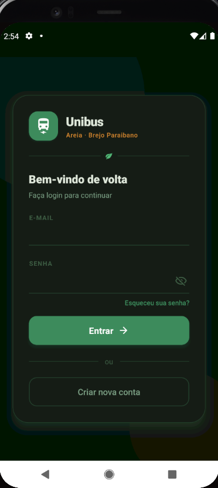
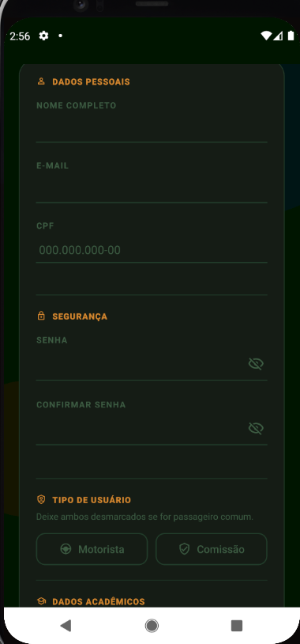
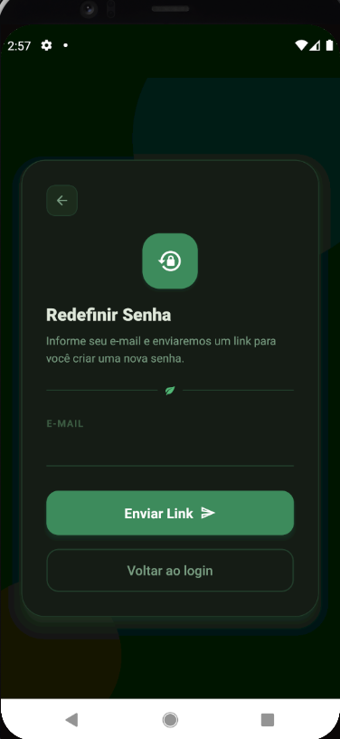
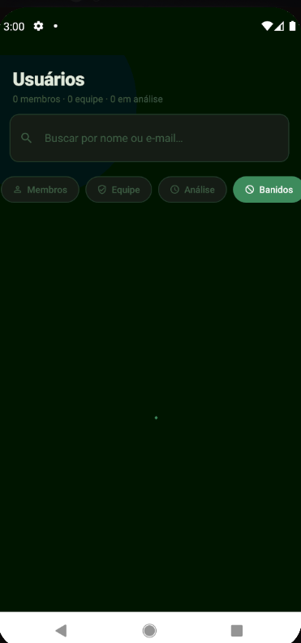

# Unibus

Aplicativo Android para organizar o transporte universitário: os estudantes se inscrevem nas viagens, a comissão e os motoristas gerenciam as viagens e os usuários, e a chamada é feita por ordem de chegada.

> Esta é a **versão app** do Unibus, feita em React Native com Firebase. O projeto depois ganhou uma **versão web** em PHP/MySQL, hospedada em servidor próprio, para atender também quem usa iPhone e incluir relatórios em PDF e cobrança de viagens pagas.

<table>
  <tr>
    <td align="center"><br><sub>Login</sub></td>
    <td align="center"><br><sub>Cadastro</sub></td>
    <td align="center"><br><sub>Recuperação de senha</sub></td>
    <td align="center"><br><sub>Gerenciamento de usuários</sub></td>
  </tr>
</table>

## Funcionalidades

### Cadastro e acesso
- Cadastro com **validação de CPF** e e-mail; cada CPF só pode ter um cadastro ativo
- Novos cadastros ficam **em análise** até serem aprovados
- Recuperação de senha por e-mail
- Sessão salva no aparelho (o usuário não precisa logar toda vez)

### Cargos e permissões
Hierarquia: **Membro < Motorista < Comissão < Administrador**

| Ação | Membro | Motorista | Comissão | Administrador |
|---|:---:|:---:|:---:|:---:|
| Inscrever-se em viagens | ✅ | | ✅ | ✅ |
| Criar, editar e excluir viagens | | ✅ | ✅ | ✅ |
| Fazer a chamada | | ✅ | ✅ | ✅ |
| Aprovar, rejeitar, banir e alterar cargos | | ✅ | ✅ | ✅ |

O cargo de Administrador só pode ser atribuído diretamente no banco de dados.

### Viagens
- Criação rápida com **modelos prontos** (rotas, motoristas, horário e limite de vagas padrão)
- Inscrição para **ida, volta ou ida e volta**, respeitando o limite de vagas
- Inscrições **fecham 30 minutos antes** da partida
- Lista de inscritos separada por ida e volta

### Chamada por ordem de chegada
- O motorista confirma a presença de cada estudante no embarque
- A lista de presença mantém a **ordem de chegada** e se reorganiza quando alguém é removido

### Rastreamento em tempo real *(experimental)*
- O motorista ativa o rastreamento e o celular dele passa a enviar a localização, **inclusive em segundo plano**
- Os estudantes acompanham o ônibus num mapa
- O rastreamento expira automaticamente 3 horas após ser ativado

## Tecnologias

| Área | Ferramentas |
|---|---|
| App | React Native 0.81, Expo SDK 54 |
| Navegação | React Navigation (stack e bottom tabs) |
| Backend | Firebase Authentication, Cloud Firestore |
| Localização | expo-location, expo-task-manager, react-native-maps |
| Outros | AsyncStorage, Expo Document Picker |

## Estrutura

```
Unibus/
├── App.js                  # ponto de entrada (AuthProvider + navegação)
├── AppNavigator.js         # decide entre telas de login e telas do app
├── AuthContext.js          # usuário logado e hierarquia de permissões
└── src/
    ├── firebaseConnection.js
    ├── pages/
    │   ├── Login/  Cadastro/  EsqueciSenha/
    │   ├── Rotas/          # viagens, inscrições, chamada e rastreamento
    │   ├── Usuarios/       # aprovação e gerenciamento de usuários
    │   ├── MapaMotorista/  # mapa com a posição do ônibus
    │   └── Perfil/
    └── assets/
        ├── ObjetoRota/     # modais de criar, editar e escolher viagem
        └── SecurityInput/  # campo de senha
```

### Banco de dados (Firestore)

```
Users/{uid}                       dados do usuário, cargo e status
CPFs/{cpf}                        controle de CPF único por cadastro
Viagens/{id}                      rota, data, hora, motorista, limite
Viagens/{id}/Inscritos/{uid}      inscritos e tipo (ida, volta, ida e volta)
Viagens/{id}/Presenca/{uid}       chamada com ordem de chegada
Rastreamento/{viagemId}           posição atual do ônibus
```

## Como rodar

**Pré-requisitos:** Node.js, npm e o app **Expo Go** no celular (ou um emulador Android).

```bash
git clone https://github.com/LucasByteX/UnibusApp.git
cd UnibusApp
npm install
npx expo start
```

### Configurando o Firebase

1. Crie um projeto no [Firebase Console](https://console.firebase.google.com/).
2. Ative o **Authentication** com e-mail e senha e o **Cloud Firestore**.
3. Coloque as credenciais do seu projeto em `src/firebaseConnection.js`.
4. Depois do primeiro cadastro, altere o `cargo` desse usuário para `Administrador` e o `status` para `ativo` direto no Firestore.

## Por que existe uma versão web?

O app foi feito para Android, porque publicar na App Store exige uma conta paga de desenvolvedor Apple. Para incluir os alunos com iPhone e sair dos limites do plano gratuito do Firebase, o sistema foi reconstruído como plataforma web, hospedada em servidor próprio. A ideia para o futuro é conectar o app a esse servidor e a um módulo de rastreamento com ESP32 e 4G/GPS.

## Status

Desenvolvimento pausado nesta versão, e o projeto Firebase original foi desativado. O repositório fica como registro do app; para testá-lo, é preciso configurar um projeto Firebase próprio (veja acima). O desenvolvimento ativo continua na versão web, e uma futura versão do app deve usar o servidor próprio no lugar do Firebase.

## Autor

**Lucas Daris de Souza**, estudante de Engenharia de Computação no IFPB
[LinkedIn](https://www.linkedin.com/in/lucas-daris-879159288/) · [GitHub](https://github.com/LucasByteX)
